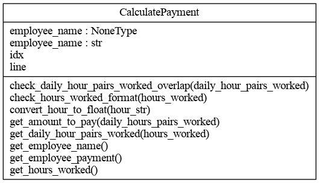
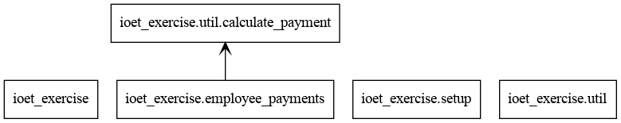

#### **IOET Exercise - Calculate the total that the ACME company has to pay an employee**

##### Prerequisites

To run the program python 3.8 must be installed

##### How to run the program

There are two possibilities to run the program: using the current python environment or using a python virtual environment.  

###### Run the program using current python environment

1. In this case is necessary install the following components using pip, we assuming that python 3.8 is executed with python3 command, then execute the following commands in the operating system console:

```
python3 -m pip install mypy
python3 -m pip install pytest
python3 -m pip install pytest-cov      
```

​		mypy is  an optional static type checker for python, and pytest is to run unit tests

2. Include in PYTHONPATH  environment variable the path to the directory where the application was installed.

3. To run the program in the directory use the following command in the operating system console:

```
python3 employee_payments.py
```

###### Run the program using a python virtual environment                        

In this case execute the following commands:

```
python3 -m pipenv install
python3 -m pipenv shell
python3 setup.py develop
```

To run the program use the following command:

```
employee_payments
```

In both cases when run employee_payments program the following is showed:

```
usage: employee_payments [-h] [--input_file_name INPUT_FILE_NAME]

optional arguments:
  -h, --help            show this help message and exit
  --input_file_name INPUT_FILE_NAME
                        input file name with employees worked hours
```

The parameter --input_file_name is used to specify the path where the employees worked hours is located, eg. if the file is located in the current directory the following command must be execute to process this file:

```
For current python environment:
python3 employee_payments.py --in employee_hours.txt

For python virtual environment:
employee_payments --in employee_hours.txt
```

##### Employee hours file configuration

The employee hours file must be filled in one employee hours detail for each line, with the following format:

```
employee_name=MO08:00-09:00,TU13:00-20:00
```

employee_name is the employee name, always = must be included, and the worked hours detail with the format DDHH:MM-HH:MM, DD is the day of the week with the following convention:

```
MO: Monday
TU: Tuesday
WE: Wednesday
TH: Thursday
FR: Friday
SA: Saturday
SU: Sunday
```

HH:MM is the hour when the employee start/end his/her work, eg. 01:00, 13:00, etc, these hour pairs must be separated using "-". An example of this file could be:

```
RENE=MO10:00-12:00,TU10:00-12:00,TH01:00-03:00,SA14:00-18:00,SU20:00-21:00
ASTRID=MO10:00-12:00,TH12:00-14:00,SU20:00-21:00
PACO=MO13:00-18:00,TU02:00-12:00,FR09:00-18:00
MATIAS=TU16:00-18:00,TU20:00-00:00,WE10:00-18:00,SA18:00-22:00
ANGELINA=WE15:00-19:00,TH09:00-15:00,FR12:00-18:00,SA08:00-17:00,SU08:00-16:00
MARGARITA=MO10:00-12:00,TH12:00-14:00,SU20:00-21:00,SU08:00-11:00
PABLO=MO13:00-18:00,TU02:00-12:00,FR09:00-18:00,SU08:00-11:00
JOHN=MO10:00-12:00,TU10:00-12:00,TH01:00-03:00,SA14:00-18:00
ANA=MO13:00-18:00,TU02:00-12:00,WE12:00-15:00,FR09:00-18:00
PERIQUITA=WE15:00-19:00,TH09:00-15:00,FR12:00-18:00,SA08:00-17:00
```

When the program is executed the following result is showed:

```
The amount to pay RENE is: 215.00 USD
The amount to pay ASTRID is: 85.00 USD
The amount to pay PACO is: 430.00 USD
The amount to pay MATIAS is: 330.00 USD
The amount to pay ANGELINA is: 605.00 USD
The amount to pay MARGARITA is: 155.00 USD
The amount to pay PABLO is: 500.00 USD
The amount to pay JOHN is: 190.00 USD
The amount to pay ANA is: 475.00 USD
The amount to pay PERIQUITA is: 435.00 USD
```

##### Program validations

The program validates the following aspects:

1. The correct path and file name used to store the employees worked hours.
2. If there are an employee name, days, and pairs of hours.
3. If the days and worked hours is in the correct format.
4. It's possible define two or more pair of hours in the same day, the program check if these are not overlapped.
5. In one pairs of hours the end hour must be greater or equal to the start hour.

In each case an error message is displayed explaining the reason in detail

##### Unit tests

To validate the program logic pytest was used, in the file util/calculate_payment.py are defined each validation, to run this validation execute:

```
pytest
```

The following is showed:

```
================================================================================== test session starts ===================================================================================
platform linux -- Python 3.8.5, pytest-6.2.3, py-1.10.0, pluggy-0.13.1
rootdir: /home/jose/ioet_exercise
plugins: cov-2.11.1
collected 6 items                                                                                                                     tests/test_employee_payments.py ......                                                                                                                                             [100%]
=================================================================================== 6 passed in 0.02s ====================================================================================
```

In this case all test were passed correctly, if an error exists the following is showed:

```
================================================================================== test session starts ===================================================================================
platform linux -- Python 3.8.5, pytest-6.2.3, py-1.10.0, pluggy-0.13.1
rootdir: /home/jose/ioet_exercise
plugins: cov-2.11.1
collected 6 items                                                                                                                     tests/test_employee_payments.py .....F                                                                                                                                             [100%]

======================================================================================== FAILURES ========================================================================================
___________________________________________________________________________________ test_amount_to_pay ___________________________________________________________________________________

    def test_amount_to_pay():
        """
        the amout to pay must be:
    
        08:00-09:00 = 01:00 * 25 = 25
        09:00-17:00 = 08:00 * 15 = 120
        19:00-00:00 = 05:00 * 20 = 100
    
        amount_to_pay = 25 + 120 + 100 = 245
        """
        calculate_payment = CalculatePayment(line="ANA=MO08:00-17:00,MO19:00-00:00", idx=0)
        hours_worked = calculate_payment.get_hours_worked()
        daily_hour_pairs_worked = calculate_payment.get_daily_hour_pairs_worked(
            hours_worked=hours_worked
        )

>       assert (
>                 calculate_payment.get_amount_to_pay(
>                     daily_hours_pairs_worked=daily_hour_pairs_worked
>                 )
>                 == 245.50
>             )
>       E       AssertionError: assert 245.0 == 245.5
>       E        +  where 245.0 = <bound method CalculatePayment.get_amount_to_pay of <util.calculate_payment.CalculatePayment object at 0x7f0cbfdb2ee0>>(daily_hours_pairs_worked={'MO': [[8.0, 17.0], [19.0, 24.0]]})
>       E        +    where <bound method CalculatePayment.get_amount_to_pay of <util.calculate_payment.CalculatePayment object at 0x7f0cbfdb2ee0>> = <util.calculate_payment.CalculatePayment object at 0x7f0cbfdb2ee0>.get_amount_to_pay
tests/test_employee_payments.py:60: AssertionError
================================================================================ short test summary info =================================================================================
FAILED tests/test_employee_payments.py::test_amount_to_pay - AssertionError: assert 245.0 == 245.5
============================================================================== 1 failed, 5 passed in 0.04s ===============================================================================
```

##### Architecture

A library was created to calculate the payment for each employee, the class CalculatePayment is located in util/calculate_payment.py and has the following structure:



The application has the following architecture:



##### Approach and methodology

This exercise is a definition of an employee's attendance at work, where the total hours worked is calculated, the amount to be paid in a range of hours is also defined with this information it is possible to calculate the amount to be paid on each day of the week and finally the weekly payment.

I use the Scrum methodology and I defined the following steps:

**Step** 1: Product Backlog Creation, here I identified the requirement and gave an approach of what should be contemplated to generate a solution to the requirement .

**Step** 2: Sprint planning and creating backlog, here I defined the steps that I needed to create a solution, and the activities for each day in this case because is a little project.

**Step** 3: Working in sprint, every day I worked in a sprint and I tested it at the same time as I did the integration tests with the products of the sprints of previous days.

**Step** 4: Testing and Product Demonstration. I created the unit tests and I will send the final product to the IOET people for application demonstration.

**Step** 5: Retrospective and the next sprint planning, in this case I reviewed the project with IOET people.